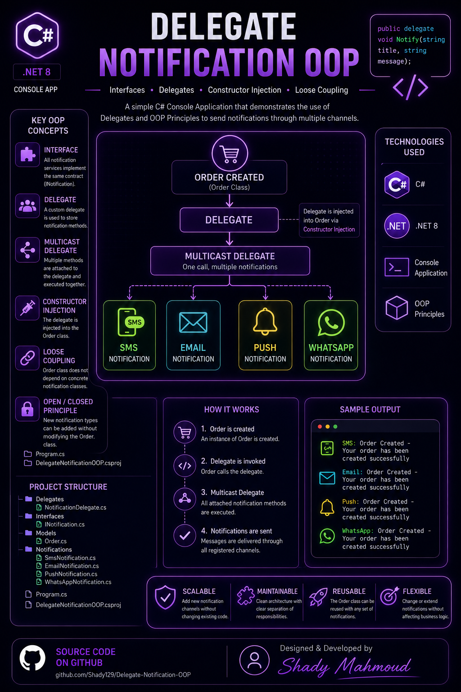

<p align="center">
  
</p>


# 🚀 Delegate Notification OOP

A simple C# Console Application that demonstrates the use of:

* Interfaces
* Delegates
* Multicast Delegates
* Constructor Injection
* Loose Coupling
* Open/Closed Principle

---

## 📌 Project Overview

This project simulates an order notification system.

When an order is created, the system sends notifications through multiple channels:

* SMS
* Email
* Push Notification
* WhatsApp

The `Order` class does not know any concrete notification classes.

Instead, it receives a Delegate through Constructor Injection and executes it when needed.

---

## 🛠 Technologies Used

* C#
* .NET 8
* Console Application
* OOP Principles

---

## 📂 Project Structure

```text
Delegate-Notification-OOP
│
├── Delegates
│   └── NotificationDelegate.cs
│
├── Interfaces
│   └── INotification.cs
│
├── Models
│   └── Order.cs
│
├── Notifications
│   ├── SmsNotification.cs
│   ├── EmailNotification.cs
│   ├── PushNotification.cs
│   └── WhatsAppNotification.cs
│
├── Program.cs
└── DelegateNotificationOOP.csproj
```

---

## 🎯 Key Concepts Demonstrated

### Interface

All notification services implement the same contract:

```csharp
public interface INotification
{
    void Send(string title, string message);
}
```

---

### Delegate

A custom delegate is used to store notification methods.

```csharp
public delegate void Notify(string title, string message);
```

---

### Multicast Delegate

Multiple notification methods are attached to the same delegate.

```csharp
myNotify += notification.Send;
```

This allows one call to trigger multiple notifications.

---

### Constructor Injection

The delegate is injected into the `Order` class.

```csharp
Order myOrder = new Order(myNotify);
```

This keeps the class flexible and reusable.

---

### Loose Coupling

The `Order` class does not depend on:

* SmsNotification
* EmailNotification
* PushNotification
* WhatsAppNotification

It only depends on the Delegate.

---

### Open/Closed Principle

New notification types can be added without modifying the `Order` class.

Example:

* PushNotification
* WhatsAppNotification

were added without changing existing business logic.

---

## ▶ Sample Output

```text
SMS: Order Created - Your order has been created successfully

Email: Order Created - Your order has been created successfully

Push: Order Created - Your order has been created successfully

WhatsApp: Order Created - Your order has been created successfully
```

---

## 👨‍💻 Author

Designed & Developed by Shady Mahmoud
